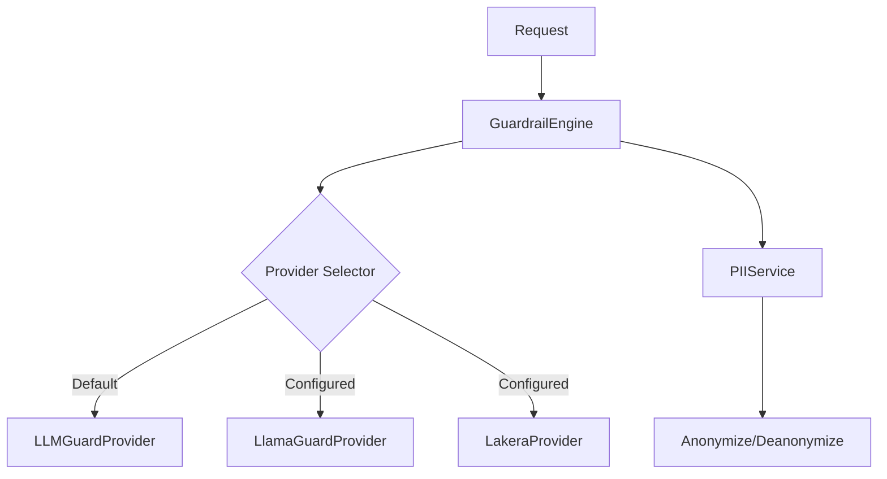

# Guardrail Component

The Guardrail component is responsible for ensuring the safety and compliance of both inputs (prompts) and outputs (LLM responses). It uses a modular provider architecture to support multiple safety engines.

## Architecture

The core of the system is the `GuardrailEngine` (`engine.py`), which orchestrates the scanning process. It delegates actual verification to **Providers**.

### Key Modules

- **`engine.py`**: Main entry point. Initializes providers and routes requests to the active provider based on configuration.
- **`config.py`**: Manages settings (thresholds, API keys, enabled scanners) via `pydantic-settings`.
- **`pii_service.py`**: Handles PII detection and redaction independently of the safety scanners.
- **`providers/`**: Contains the implementations for different safety engines.

## Providers

The system supports pluggable providers inheriting from `GuardrailProvider` (`providers/base.py`).

### 1. LLM Guard (Local)

**File**: `providers/llm_guard_provider.py`
**Description**: Runs local safety models using the `llm-guard` library.
**Features**:

- Granular control over scanners (Toxicity, Secrets, Code, etc.)
- No external API calls (privacy-focused).
- Configuration: `input_scanners` and `output_scanners` lists.

### 2. Llama Guard (Groq)

**File**: `providers/llama_guard_provider.py`
**Description**: Uses Meta's Llama Guard model hosted on Groq for high-speed, chat-optimized safety checks.
**Configuration**:

- Requires `GUARDRAIL_GROQ_API_KEY`.
- Supports specific safety categories:
  - Violent Crimes
  - Hate Speech
  - Sexual Content
  - Code Interpreter Abuse
  - etc.

### 3. Lakera Guard (API)

**File**: `providers/lakera_provider.py`
**Description**: Integrates with Lakera AI's Guard API (v2).
**Focus**: Specialized in **Prompt Injection** and Jailbreak detection.
**Configuration**:

- Requires `GUARDRAIL_LAKERA_API_KEY`.
- Supports categories like `prompt_injection`, `sexual_content`, `hate_speech`.

## PII Service

**File**: `pii_service.py`

Handles Personally Identifiable Information (PII) separately from safety checks.

- **Detection**: Identifies entities like Emails, Phone Numbers, Credit Cards, SSNs.
- **Redaction**: Replaces PII with placeholders (e.g., `<EMAIL_ADDRESS>`).
- **Vault**: Can optionally store original values for deanonymization (not fully persisted in current MVP).

## Configuration

Configuration is managed via `config.py` and environment variables (`.env`).

### Environment Variables

| Variable | Description | Default |
| :--- | :--- | :--- |
| `GUARDRAIL_ENABLE_GUARDRAILS` | Master switch | `True` |
| `GUARDRAIL_DEFAULT_GUARDRAIL_ENGINE` | Default provider | `llm-guard` |
| `GUARDRAIL_GROQ_API_KEY` | Key for Llama Guard | `None` |
| `GUARDRAIL_LAKERA_API_KEY` | Key for Lakera Guard | `None` |
| `GUARDRAIL_PII_DETECTION_ENABLED` | Enable PII scanning | `True` |

### Granular Control

The Dashboard allows granular selection of which scanners to run for each engine via the configuration API.
